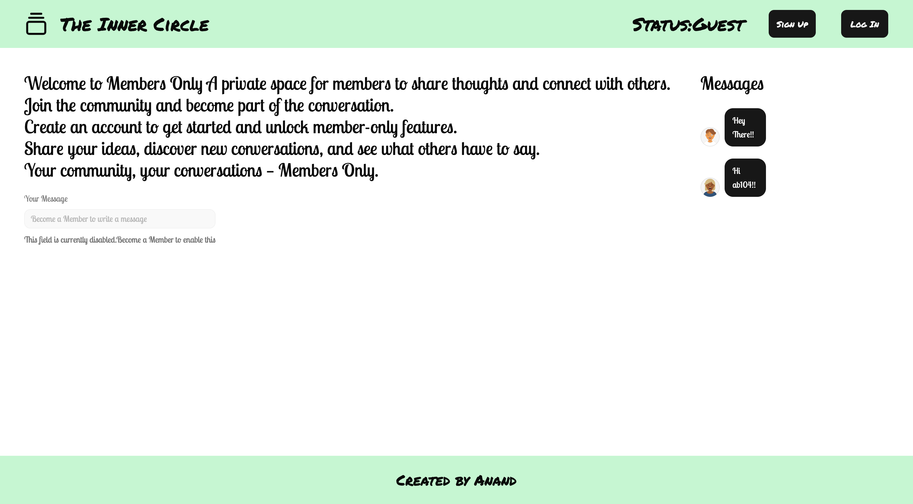
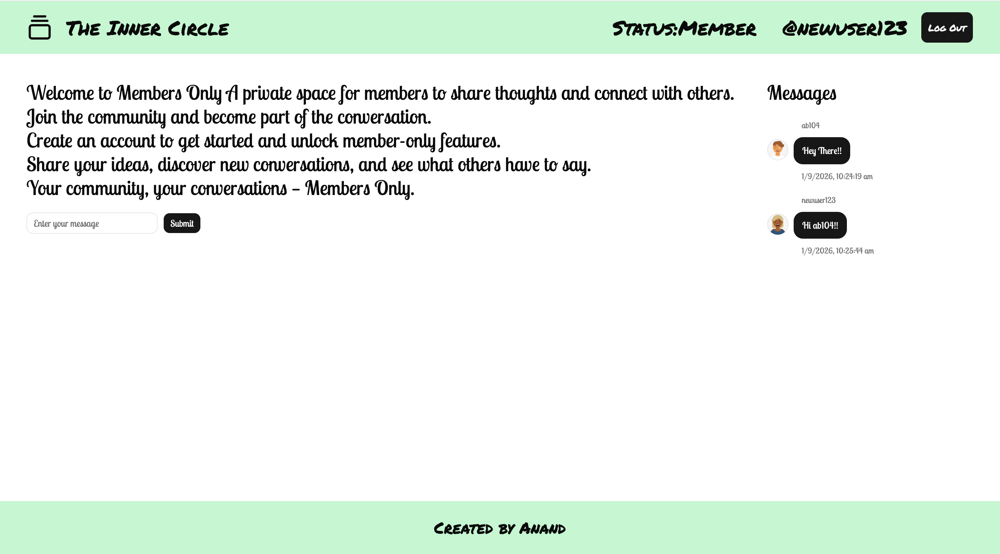
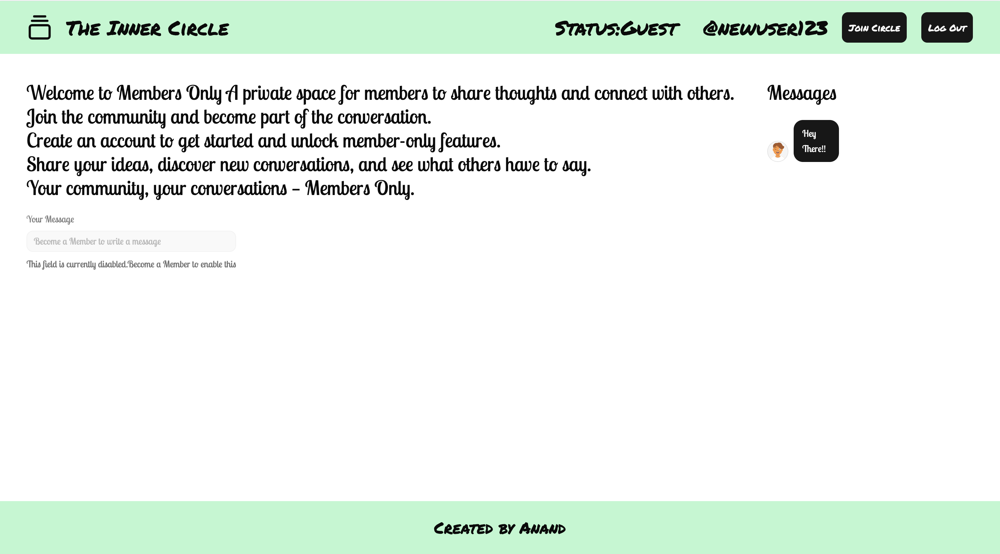

# members-only

Members Only is a full-stack private messaging application where users can create accounts, log in, and participate in an exclusive community.

Users can share and view messages, while members get access to exclusive features. The application also includes different roles such as regular users, members, and administrators.

## Features

- User registration and login
- Authentication using Passport.js
- Session-based authentication
- Member-only access
- Admin and member roles
- Create, view, and delete messages
- Protected routes and authorization middleware
- PostgreSQL database for storing users and messages
- Responsive user interface

## Tech Stack

### Frontend
- React
- TypeScript
- Vite
- Tailwind CSS
- shadcn/ui

### Backend
- Node.js
- Express.js
- Passport.js
- REST APIs

### Database & Authentication
- PostgreSQL
- Neon
- express-session
- connect-pg-simple

### Deployment
- Vercel - Frontend
- Render - Backend
- Neon - Database

## How It Works

Users can create an account and log in to the application. After authentication, a session is created to keep track of the logged-in user.

Regular users have access to the basic features, while users who become members can access the private community. Administrators have additional privileges for managing the application.

The React frontend communicates with the Express backend through REST APIs. The backend handles authentication, authorization, application logic, and communication with the PostgreSQL database.

## Project Structure

```text
members-only/
├── client/
│   ├── src/
│   └── package.json
│
├── server/
│   ├── controller/
│   ├── db/
│   ├── middleware/
│   ├── routes/
│   ├── app.js
│   └── package.json
│
└── README.md

The deployment of the project can be found on https://members-only-theta-three.vercel.app/





